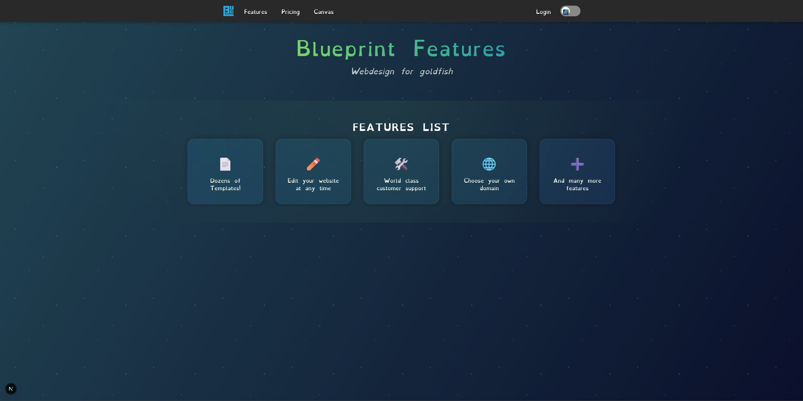
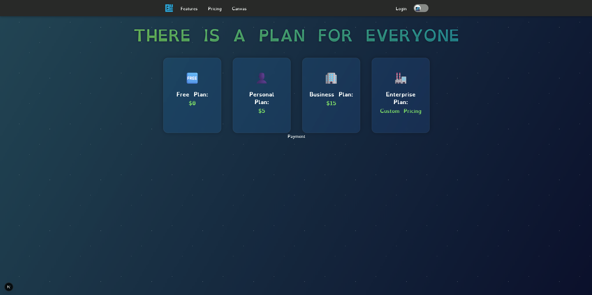
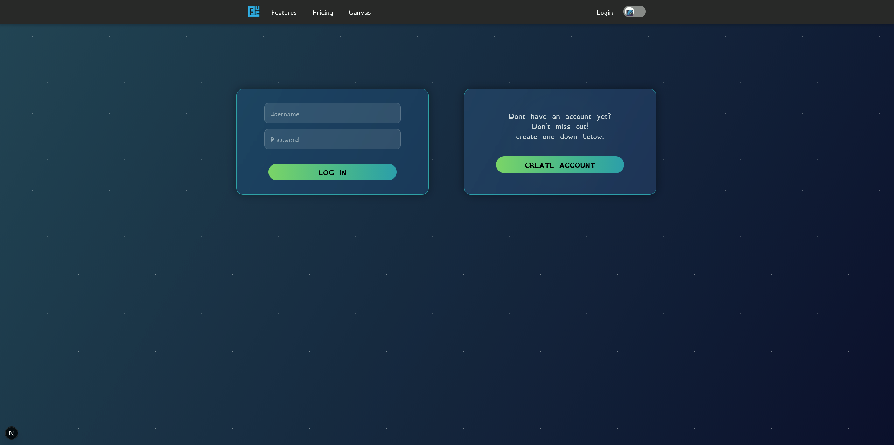
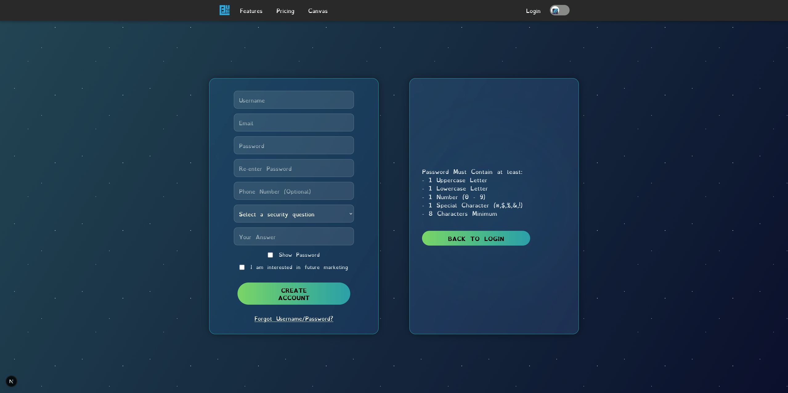
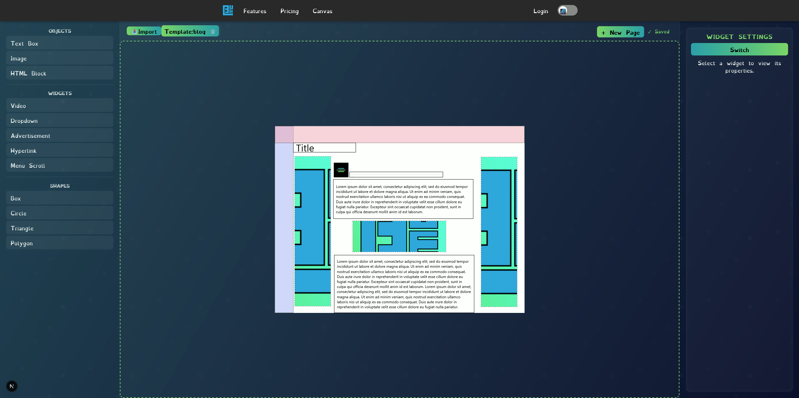

        </img>
        <h1>CPU Hornets - Blueprint</h1>

# Table of Contents
- [Synopsis](https://github.com/conner-chil32/Blueprint#synopsis)
    - [Objective](https://github.com/conner-chil32/Blueprint?tab=readme-ov-file#objective)
    - [Stack](https://github.com/conner-chil32/Blueprint?tab=readme-ov-file#stack)
    - [Current-User-Flow](https://github.com/conner-chil32/Blueprint?tab=readme-ov-file#current-user-flow)
- [Deployment](https://github.com/conner-chil32/Blueprint?tab=readme-ov-file#deployment)
- [Testing](https://github.com/conner-chil32/Blueprint?tab=readme-ov-file#testing)
- [Development-Notes](https://github.com/conner-chil32/Blueprint?tab=readme-ov-file#development-notes)
  
## Creators
### Conner Childers
Contact Information:
 - Email: cc457904@gmail.com
 - LinkedIn: https://www.linkedin.com/in/conner-childers-511128267/
### Elijah White
Contact Information:
 - Email: elijah.white.scott@gmail.com
 - LinkedIn: https://www.linkedin.com/in/elijah-white-937461194/
### Christopher Parsons
Contact Information:
 - Email: bomrr12@gmail.com
 - LinkedIn: www.linkedin.com/in/christopher-parsons-599723256
### Aaron Goodlund
Contact Information:
 - Email: agoodlund229@gmail.com
 - LinkedIn: www.linkedin.com/in/aaron-goodlund-18011617a
### Lydell Jones
Contact Information:
 - Email: lydell1233@gmail.com
 - LinkedIn: https://www.linkedin.com/in/lydell-jones/
### Jacob Francis
Contact Information:
 - Email: jacobfrancisr1@gmail.com
 - LinkedIn: linkedin.com/in/jfncs
### David Vigil
Contact Information:
 - Email: dvigil658@gmail.com
 - Linkedin: https://www.linkedin.com/in/david-vigil-dev/
### Angel Ramirez
Contact Information:
 - Email: angelr050103@gmail.com
 - LinkedIn: linkedin.com/in/angelramirez003
### Alex Miller
Contact Information:
 - Email: 

## Synopsis

### Objective

- Blueprint is centered on creating a web application that allows users to drag and drop elements into a space to build their own website with ease of use. Users will also be able to manage their own backend of their own website with with flexibility to suit their personal and/or business needs.

### Features

- Password Validation
- Multi-Factor Authentication
- Account Creation/Recovery
- User Created Website Download
<!--
- Domain Registration 
- AWS Integration
- Mobile Friendly Design
-->
### Stack
<h4 align="center">Front End</h3>

    </img>
    </img>
    </img>

- Node
- Tailwind
- NextJS

<h4 align="center">Back End</h3>

    </img>
    </img>
    </img>

- Docker
- MySQL
- Wordpress

<h4>Hosting Platform</h3>
<h5>Local Server</h5>

<!--  I don't know what image there is to portray a local server    
</img>

- Amazon Web Services
-->
### Current User Flow

## Deployment

<h4>System Requirements</h4>
- Docker Desktop - v28.5.1

<h4>Deployment Information</h4>

This application was designed to be deployed on physical hardware and thus was used with containerization from docker.

Our application is composed of 6 containers created and orchestrated with Docker Compose.

If this application were to be deployed on another machine, virtual or otherwise the following steps and restrictions need to be followed and considered.

<h4>Application default configuration</h4>

<h5>Ports used (External)<h5>

- 3306
- 8080
- 3000
- 3307
- 8000

<h5>Disk Usage<h5>

- Virtual = 4.83 GB

- Approximate Physical ~= 7-8 GB

<h4>Steps to deploy</h4>

<h5>1. Server Prerequisites</h5>

- Install Node.js (v18 or higher)
- Install Docker and Docker Compose
- Install Git
- Configure firewall to allow ports:
  - 80
  - 443
  - 3000
  - 3306
  - 8000
  - 8080

<h5>2. Clone Repository</h5>

- SSH into your webserver
- Clone the repository: `git clone https://github.com/conner-chil32/Blueprint.git`
- Navigate to project directory: `(cd ./blueprint)`

<h5>3. Environment Configuration</h5>

- Copy .env_example to .env
- Update environment variables:
  - Change `ADDRESS` from localhost to your server's domain/IP
  - Set strong passwords for all database credentials
  - Update `CONTAINER_NAME` if needed

<h5>4. Build Next.js Application</h5>

- Navigate to ./blueprint directory
- Run npm install to install dependencies
- Run npm run build to create production build
- Verify .next folder is created

<h5>5. Start Docker Services</h5>

- Return to root directory
- Run docker-compose up -d to start all services:
  - MySQL database (port 3306)
  - WordPress database (port 3307)
  - WordPress (port 8000)
  - phpMyAdmin (port 8080)
  - Next.js web app (port 3000)

<h5>6. Database Initialization</h5>

- Wait for Docker containers to fully initialize (~2-3 minutes)
- Database schemas will be created automatically from `./dbstart scripts`
- Verify databases are running: `docker ps`

<h5>7. Configure Reverse Proxy (Nginx/Apache)</h5>

- Install Nginx or Apache as reverse proxy
- Configure proxy to forward:
  - Port 80/443 → Port 3000 (Next.js app)
  - Subdomain/path for WordPress → Port 8000
- Set up SSL certificates

<h5>8. Configure Domain/DNS</h5>

- Point your domain A record to server IP address
- Configure any subdomains for WordPress if needed
- Wait for DNS propagation (up to 48 hours)

<h5>9. Production Optimizations</h5>

- Set `NODE_ENV=production` in environment
- Configure Docker restart policies: restart: unless-stopped
- Set up log rotation for Docker containers
- Configure MySQL for production (buffer pools, connections)

<h5>10. Set Up Process Management</h5>

- Configure Docker to start on boot: `systemctl enable docker`
- Create systemd service for auto-restart
- Alternative: Use PM2 for Next.js if not using Docker for web app

<h5>11. Security Hardening</h5>

- Disable phpMyAdmin on production (port 8080)
- Change MySQL root passwords
- Configure firewall rules (UFW/iptables)
- Set up fail2ban for SSH protection
- Enable MySQL only on localhost if not needed externally

<h5>12. Monitoring & Backups</h5>

- Set up health checks for containers
- Configure automated MySQL backups
- Set up disk space monitoring
- Configure log aggregation
- Set up uptime monitoring

<h5>13. Testing</h5>

- Test Next.js app: `http://$INSERT_DOMAIN$.com`
- Test WordPress: `http://$INSERT_DOMAIN$:8000`
- Verify database connections work
- Test all application features

<h5>14. Ongoing Maintenance</h5>

- Regular security updates: `docker-compose pull && docker-compose up -d`
- Monitor disk space (MySQL data grows)
- Review logs regularly: `docker-compose logs`
- Backup databases before updates

## Testing

<h4>System Requirements</h4>

- Windows 11
- Google Chrome, Desktop
- Node - v22.17.0
- Docker Desktop - v28.5.1
- React v19.0.0

<h4>Testing Steps</h4>

CD into …/Blueprint/blueprint
In the terminal, to install all required packages:
  - npm install
    - Note: If the project has errors with modules not found, you may need to cd back into /Blueprint and run npm install again before returning to Blueprint/blueprint.
To run all frontend tests:
- npm run test:frontend
To run a specific test:
- npm test (filename)

To perform manual testing, you can run the entire project by running docker with this command:
  - docker-compose up
From there, wait for all docker containers to spin up. This may take a few minutes.
You can then head to http://localhost:3000/ and perform testing on any page. When you are finished: 
1. ctrl+C in your terminal to turn off the server
2. Run docker-compose down to spin down the containers 
1. delete the blueprint/lib/db_data file and restore the .htaccess_dummy file
If you make any changes to the server, be sure to rebuild the containers before spinning up again.

### Prototype

  

    </img>
    </img>
    </img>
    </img>
    </img>
  

  

    </img>
    </img>
    </img>
    </img>
    </img>
  

### Deployed Site

  

     <!-- I have no idea how the original images were stored -->
    
    
    
    
  

  

    
    
    
    
    
    
  

### Database ERD

